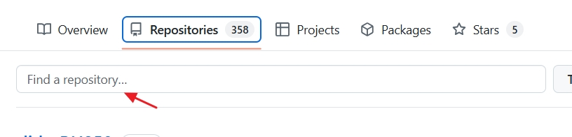
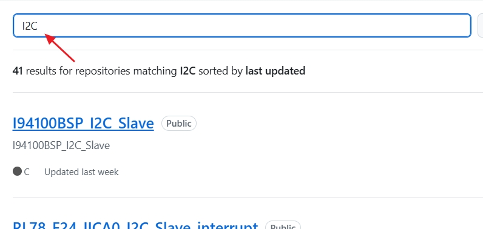

Home
===

slide
---

[CS+/Smart Configurator/RFP(RL78)](https://released.github.io/slide_RL78/ "slide_RL78")      

[CS+/Smart Configurator/RFP(RH850)](https://released.github.io/slide_RH850/ "slide_R850")  

[boot loader(RL78)](https://released.github.io/slide_boot_loader_for_RL78/ "boot_loader_for_RL78") 

example code
---

[some example code...](https://github.com/released/ "some example code...")

* entry github repositories

* input target keyword , ex : I2C , ADC , etc

* select the project 

* how to download project ?

