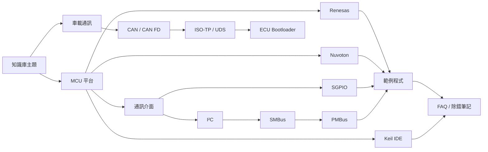

# 嵌入式系統知識庫

> 彙整 MCU 開發工具、通訊協定、韌體更新、FAQ、除錯案例與範例程式。最後更新：2026-07-15。

本站包含 Renesas、Nuvoton、Keil、SGPIO、I²C / SMBus / PMBus、CAN / CAN FD、UDS 與 ECU Bootloader 等主題。各項目可獨立查閱，主題之間的技術關聯整理於下方關聯圖。

## 如何使用這個知識庫

| 項目 | 入口 | 內容說明 |
|---|---|---|
| MCU 平台 | [Renesas 專題](#renesas)、[Nuvoton 專題](#nuvoton) | IDE、compiler、Smart Configurator、燒錄工具、周邊與平台實作 |
| SGPIO | [SGPIO 詳細知識庫](https://released.github.io/notices_sgpio/) | SFF-8485 frame、SFF-8489 / IBPI、slot decode、software capture 與驗證工具 |
| I²C / SMBus / PMBus | [I²C / SMBus / PMBus 知識庫](https://released.github.io/notices_i2c/) | I²C electrical/frame、SMBus transaction/PEC/recovery、PMBus command/profile |
| 範例程式 | [範例程式索引](#example-code) | 依 MCU、周邊與關鍵字整理的 GitHub repository 查找方式 |
| FAQ 與除錯 | [FAQ 與除錯筆記](#faq) | Keil、Nuvoton、Renesas 與跨平台問題紀錄 |
| CAN / CAN FD | [CAN / CAN FD 知識庫](https://released.github.io/notices_can/ "CAN / CAN FD Knowledge Base") | 實體層、frame、arbitration、bit timing、error handling 與 controller |
| UDS / ISO-TP / Bootloader | [UDS / ISO-TP / ECU Bootloader 知識庫](https://released.github.io/notices_can_uds/ "UDS Knowledge Base") | Transport、診斷服務、session、security 與 ECU firmware update |

## 主題關聯圖

圖中呈現各知識庫主題之間的技術層次、平台關係與對應資源，不代表固定閱讀順序。

```mermaid
flowchart LR
    START["知識庫主題"] --> MCU["MCU 平台"]
    MCU --> RENESAS["Renesas"]
    MCU --> NUVOTON["Nuvoton"]
    MCU --> KEIL["Keil IDE"]
    MCU --> IFACE["通訊介面"]
    IFACE --> SGPIO["SGPIO"]
    IFACE --> I2C["I²C"]
    I2C --> SMBUS["SMBus"]
    SMBUS --> PMBUS["PMBus"]
    RENESAS --> EXAMPLE
    NUVOTON --> EXAMPLE
    SGPIO --> EXAMPLE
    PMBUS --> EXAMPLE
    EXAMPLE["範例程式"] --> FAQ["FAQ / 除錯筆記"]
    KEIL --> FAQ
    START --> COMM["車載通訊"]
    COMM --> CAN["CAN / CAN FD"]
    CAN --> UDS["ISO-TP / UDS"]
    UDS --> BOOT["ECU Bootloader"]
```

---

## Renesas 平台專題

Renesas 內容涵蓋 CS+、Smart Configurator、Renesas Flash Programmer，以及 RL78 / RH850 的啟動、記憶體與周邊資料流。

| 項目 | 內容說明 |
|---|---|
| [CS+ / Smart Configurator / RFP（RL78）](https://released.github.io/slide_RL78/ "slide_RL78") | RL78 專案建立、程式碼產生與燒錄工具操作 |
| [CS+ / Smart Configurator / RFP（RH850）](https://released.github.io/slide_RH850/ "slide_RH850") | RH850 開發流程與工具鏈整合 |
| [RL78 Option Byte Calculator](https://released.github.io/option_byte_calculator/rl78/ "RL78 Option Byte Calculator") | 依型號雙向轉換 C0～C4 HEX、bit、欄位行為與合法性警告 |
| [RH850 Option Byte Calculator](https://released.github.io/option_byte_calculator/rh850/ "RH850 Option Byte Calculator") | 依型號雙向轉換 OPBT0／OPBT1、bit、欄位行為與保留位警告 |
| [RL78 Bootloader](https://released.github.io/slide_boot_loader_for_RL78/ "boot_loader_for_RL78") | RL78 啟動載入與更新流程 |
| [RH850 UART DMA 流程](https://released.github.io/slide_RH850_UART_DMA/ "RH850 UART DMA flow") | UART、DMA 與中斷之間的資料搬移關係 |
| [RH850 F1KM Memory Map](https://released.github.io/slide_RH850_F1KM_Memory_map/ "RH850 F1KM Memory map") | 記憶體區域、位址配置與 linker 設定 |

> 本區同時包含工具鏈內容，以及 Bootloader、UART DMA、Memory Map 等獨立專題。

---

## Nuvoton 平台專題

Nuvoton 內容涵蓋 ISP 程式放置策略與音訊處理操作，包括 LDROM、APROM、啟動來源、更新復原與 AEC / NR 驗證。

| 項目 | 內容說明 |
|---|---|
| [ISP 程式分別放置於 LDROM 與 APROM](https://released.github.io/slide_Nuvoton-ISP-code_in_LDROM_APROM/ "Nuvoton ISP code place in LDROM and APROM") | 比較兩個記憶體區域的職責、切換與更新流程 |
| [ISP 程式放置於 APROM](https://released.github.io/slide_Nuvoton-ISP-code_in_APROM/ "Nuvoton ISP code place in APROM") | 單一 APROM 配置下的 ISP 設計與限制 |
| [AEC / NR 操作](https://released.github.io/slide_Nuvoton_AEC_NR_operation/ "Nuvoton AEC NR operation") | Acoustic Echo Cancellation 與 Noise Reduction 的操作流程 |

---

## 通訊介面知識庫

| 主題 | 內容 | 對應範例與工具 |
|---|---|---|
| [SGPIO 詳細知識庫](https://released.github.io/notices_sgpio/) | SFF-8485 frame、SFF-8489 / IBPI、slot decode、software capture 與除錯 | M031／MS51 SGPIO、SGPIO HID Tool、SMBus/SGPIO Tool |
| [I²C → SMBus → PMBus](https://released.github.io/notices_i2c/) | I²C electrical/frame、SMBus transaction/PEC/recovery、PMBus command/profile | M031 SMBus／PMBus slave、PMBus/SMBus GUI tools |

I²C 定義 address、ACK、repeated START 與 open-drain bus；SMBus 增加 transaction、PEC、timeout 與 system-management services；PMBus 在 SMBus transport 上定義 power command language。SGPIO 是獨立的 synchronous slot stream，也可與 SMBus register／override policy 結合驗證。

---

## 範例程式

- [開啟範例程式索引](https://released.github.io/example_code/ "Embedded example code index")：依 MCU 與周邊功能尋找可參考的 GitHub 範例程式。

每個範例包含特定 MCU、開發板、toolchain、系統時脈與 pin assignment 條件。正式專案的整合範圍通常還包含錯誤處理、timeout、資源競爭與安全機制。

---

## FAQ 與除錯筆記

FAQ 收錄開發板／MCU 型號、工具版本、時脈與 pin 設定、錯誤訊息、暫存器狀態及可重現案例等資訊。

- [Keil IDE FAQ](https://released.github.io/faq_keil/ "FAQ for Keil IDE")：IDE、編譯器、debugger 與專案設定常見問題。
- [Nuvoton FAQ](https://released.github.io/faq_nuvoton/ "FAQ for Nuvoton platform")：Nuvoton 平台開發與周邊設定筆記。
- [Renesas FAQ](https://released.github.io/faq_renesas/ "FAQ for Renesas platform")：Renesas MCU、IDE 與工具鏈常見問題。
- [其他開發筆記](https://released.github.io/notices_misc/ "Miscellaneous development notes")：跨平台觀念、工具與零散問題紀錄。

### 除錯檢查項目

- 供電、接線、時脈、pin mux 與外部元件。
- IDE、編譯選項、linker 設定與燒錄內容。
- 狀態暫存器、中斷旗標、buffer / FIFO 與實際波形。
- 最小重現案例與應用層功能差異。

---

## 車載通訊：CAN、UDS 與 Bootloader

本區包含 CAN / CAN FD 資料鏈路層、ISO-TP 分段傳輸、UDS 診斷服務與 ECU 韌體更新等相互關聯的主題。

### CAN / CAN FD

- [CAN / CAN FD 知識庫](https://released.github.io/notices_can/ "CAN / CAN FD Knowledge Base")：涵蓋實體層、frame、仲裁、bit timing、錯誤處理、控制器設定與實務除錯。

### ISO-TP / UDS / ECU Bootloader

- [UDS 與診斷服務總覽](https://released.github.io/notices_can_uds/ "UDS Knowledge Base")：協定分層、request / response、SID、NRC 與 session。
- [ISO 14229 / ISO 15765-2 指南](https://released.github.io/notices_can_uds/iso/ "UDS ISO Guide")：理解 UDS 服務語意、DoCAN 與 ISO-TP 分段傳輸。
- [ECU Bootloader 韌體更新指南](https://released.github.io/notices_can_uds/bootloader/ "UDS Bootloader Guide")：串接 programming session、security、erase、download、verify 與 reset 流程。

> 主題關聯：CAN / CAN FD 提供 frame 傳輸；ISO-TP 處理分段與重組；UDS 定義診斷服務；Bootloader 將相關服務連接至 Flash programming 流程。

---

## English Summary

This site is an embedded-development reference hub covering Renesas and Nuvoton platforms, SGPIO and I²C/SMBus/PMBus protocols, example code, FAQs, CAN / CAN FD, ISO-TP, UDS, and ECU bootloader programming.

[回到頁首](#article_top)
