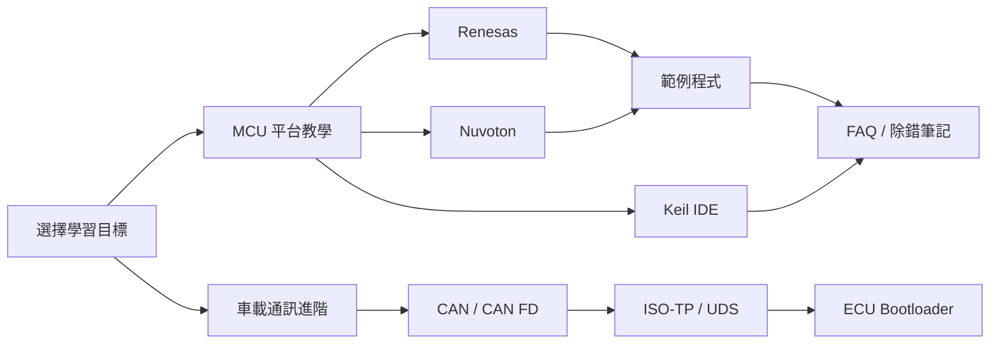

# 嵌入式系統學習知識庫

> 從 MCU 開發工具、通訊協定到韌體更新與除錯案例，依照學習目標快速找到合適的教材、FAQ 與範例程式。最後更新：2026-07-12。

本站整理 Renesas、Nuvoton、Keil、CAN / CAN FD、UDS 與 ECU Bootloader 等主題。第一次造訪時，建議先從下方的「如何使用這個知識庫」選擇目標，再依學習地圖循序閱讀。

## 如何使用這個知識庫

| 你的目標 | 建議入口 | 適合對象 |
|---|---|---|
| 尋找 MCU 平台教材 | [Renesas 專題](#renesas)或是 [Nuvoton 專題](#nuvoton) | 正在使用特定 MCU、IDE 或燒錄工具 |
| 直接參考實作 | [範例程式](#example-code) | 希望從可執行範例理解 API 與周邊操作 |
| 排除開發問題 | [FAQ 與除錯筆記](#faq) | 已遇到工具、平台或實作問題 |
| 建立車載通訊基礎 | [CAN / CAN FD 初階知識庫](https://released.github.io/notices_can/ "CAN / CAN FD Beginner Knowledge Base") | 第一次接觸 CAN、準備進行控制器設定與除錯 |
| 學習診斷與韌體更新 | [UDS / ISO-TP / ECU Bootloader 知識庫](https://released.github.io/notices_can_uds/ "UDS Knowledge Base") | 已理解 CAN frame，希望進入診斷與燒錄流程 |

## 學習地圖

建議先從 MCU 平台教材進入，再搭配範例程式與 FAQ 完成實作；需要車載通訊時，再進入 CAN、UDS 與 Bootloader 進階路線。

```mermaid
flowchart LR
    START["選擇學習目標"] --> MCU["MCU 平台教學"]
    MCU --> RENESAS["Renesas"]
    MCU --> NUVOTON["Nuvoton"]
    MCU --> KEIL["Keil IDE"]
    RENESAS --> EXAMPLE
    NUVOTON --> EXAMPLE
    EXAMPLE["範例程式"] --> FAQ["FAQ / 除錯筆記"]
    KEIL --> FAQ
    START --> COMM["車載通訊進階"]
    COMM --> CAN["CAN / CAN FD"]
    CAN --> UDS["ISO-TP / UDS"]
    UDS --> BOOT["ECU Bootloader"]
```

### 建議閱讀方式

1. 先閱讀概念頁，確認專有名詞與系統邊界。
2. 再進入對應平台教材，對照時脈、暫存器、記憶體與工具設定。
3. 使用範例程式建立最小可重現環境。
4. 遇到異常時，從 FAQ 與除錯筆記核對硬體、設定與軟體狀態。

---

## Renesas 平台專題

Renesas 教材聚焦 CS+、Smart Configurator、Renesas Flash Programmer，以及 RL78 / RH850 的啟動、記憶體與周邊資料流。

| 教材 | 學習重點 |
|---|---|
| [CS+ / Smart Configurator / RFP（RL78）](https://released.github.io/slide_RL78/ "slide_RL78") | RL78 專案建立、程式碼產生與燒錄工具操作 |
| [CS+ / Smart Configurator / RFP（RH850）](https://released.github.io/slide_RH850/ "slide_RH850") | RH850 開發流程與工具鏈整合 |
| [RL78 Bootloader](https://released.github.io/slide_boot_loader_for_RL78/ "boot_loader_for_RL78") | RL78 啟動載入與更新流程 |
| [RH850 UART DMA 流程](https://released.github.io/slide_RH850_UART_DMA/ "RH850 UART DMA flow") | UART、DMA 與中斷之間的資料搬移關係 |
| [RH850 F1KM Memory Map](https://released.github.io/slide_RH850_F1KM_Memory_map/ "RH850 F1KM Memory map") | 記憶體區域、位址配置與 linker 設定 |

> 建議先閱讀工具鏈教材，再依專案需求進入 Bootloader、UART DMA 或 Memory Map 專題。

---

## Nuvoton 平台專題

Nuvoton 教材涵蓋 ISP 程式放置策略與音訊處理操作。閱讀 ISP 主題時，請特別留意 LDROM、APROM、啟動來源與更新失敗後的復原策略。

| 教材 | 學習重點 |
|---|---|
| [ISP 程式分別放置於 LDROM 與 APROM](https://released.github.io/slide_Nuvoton-ISP-code_in_LDROM_APROM/ "Nuvoton ISP code place in LDROM and APROM") | 比較兩個記憶體區域的職責、切換與更新流程 |
| [ISP 程式放置於 APROM](https://released.github.io/slide_Nuvoton-ISP-code_in_APROM/ "Nuvoton ISP code place in APROM") | 單一 APROM 配置下的 ISP 設計與限制 |
| [AEC / NR 操作](https://released.github.io/slide_Nuvoton_AEC_NR_operation/ "Nuvoton AEC NR operation") | Acoustic Echo Cancellation 與 Noise Reduction 的操作流程 |

---

## 範例程式

- [開啟範例程式索引](https://released.github.io/example_code/ "Embedded example code index")：依 MCU 與周邊功能尋找可參考的 GitHub 範例程式。

使用範例前，請先核對 MCU 型號、開發板版本、toolchain、系統時脈與 pin assignment。範例的價值在於提供最小工作路徑；移植到正式專案時，仍應依資料手冊與專案需求檢查錯誤處理、timeout、資源競爭與安全機制。

---

## FAQ 與除錯筆記

FAQ 適合在「已能重現問題」之後查閱。建議同時記錄開發板／MCU 型號、工具版本、時脈與 pin 設定、錯誤訊息、暫存器狀態，以及可重現問題的最小程式。

- [Keil IDE FAQ](https://released.github.io/faq_keil/ "FAQ for Keil IDE")：IDE、編譯器、debugger 與專案設定常見問題。
- [Nuvoton FAQ](https://released.github.io/faq_nuvoton/ "FAQ for Nuvoton platform")：Nuvoton 平台開發與周邊設定筆記。
- [Renesas FAQ](https://released.github.io/faq_renesas/ "FAQ for Renesas platform")：Renesas MCU、IDE 與工具鏈常見問題。
- [其他開發筆記](https://released.github.io/notices_misc/ "Miscellaneous development notes")：跨平台觀念、工具與零散問題紀錄。

### 除錯順序

1. 確認供電、接線、時脈、pin mux 與外部元件。
2. 確認 IDE、編譯選項、linker 設定與燒錄內容。
3. 觀察狀態暫存器、中斷旗標、buffer / FIFO 與實際波形。
4. 用最小範例重現，再逐步加入應用層功能。

---

## 車載通訊：CAN、UDS 與 Bootloader

這條路線由資料鏈路層開始，逐步進入分段傳輸、診斷服務與 ECU 韌體更新。若尚不熟悉 CAN ID、DLC、arbitration、bit timing 或 error state，請先完成初階內容。

### 基礎：CAN / CAN FD

- [CAN / CAN FD 初階知識庫](https://released.github.io/notices_can/ "CAN / CAN FD Beginner Knowledge Base")：涵蓋實體層、frame、仲裁、bit timing、錯誤處理、控制器設定與實務除錯。

### 進階：ISO-TP / UDS / ECU Bootloader

- [UDS 與診斷服務總覽](https://released.github.io/notices_can_uds/ "UDS Knowledge Base")：先建立協定分層、request / response、SID、NRC 與 session 觀念。
- [ISO 14229 / ISO 15765-2 指南](https://released.github.io/notices_can_uds/iso/ "UDS ISO Guide")：理解 UDS 服務語意、DoCAN 與 ISO-TP 分段傳輸。
- [ECU Bootloader 韌體更新指南](https://released.github.io/notices_can_uds/bootloader/ "UDS Bootloader Guide")：串接 programming session、security、erase、download、verify 與 reset 流程。

> 學習檢查點：能說明 CAN frame 與 UDS PDU 的差異，並能判斷問題發生在實體層、傳輸層、診斷服務或 Flash programming 階段。

---

## English Summary

This site is a learning hub for embedded development. It connects Renesas and Nuvoton platform guides, Keil and vendor FAQs, practical example code, and a structured automotive path from CAN / CAN FD fundamentals to ISO-TP, UDS, and ECU bootloader programming.

[回到頁首](#article_top)
