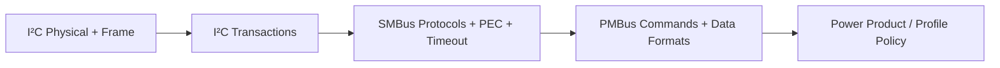
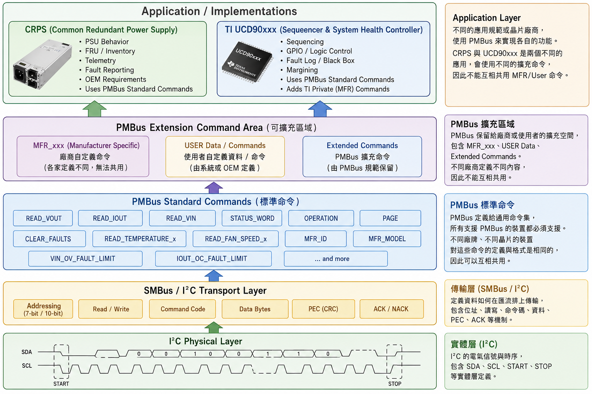
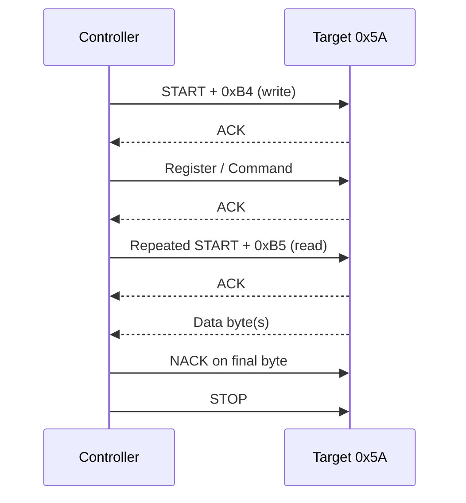
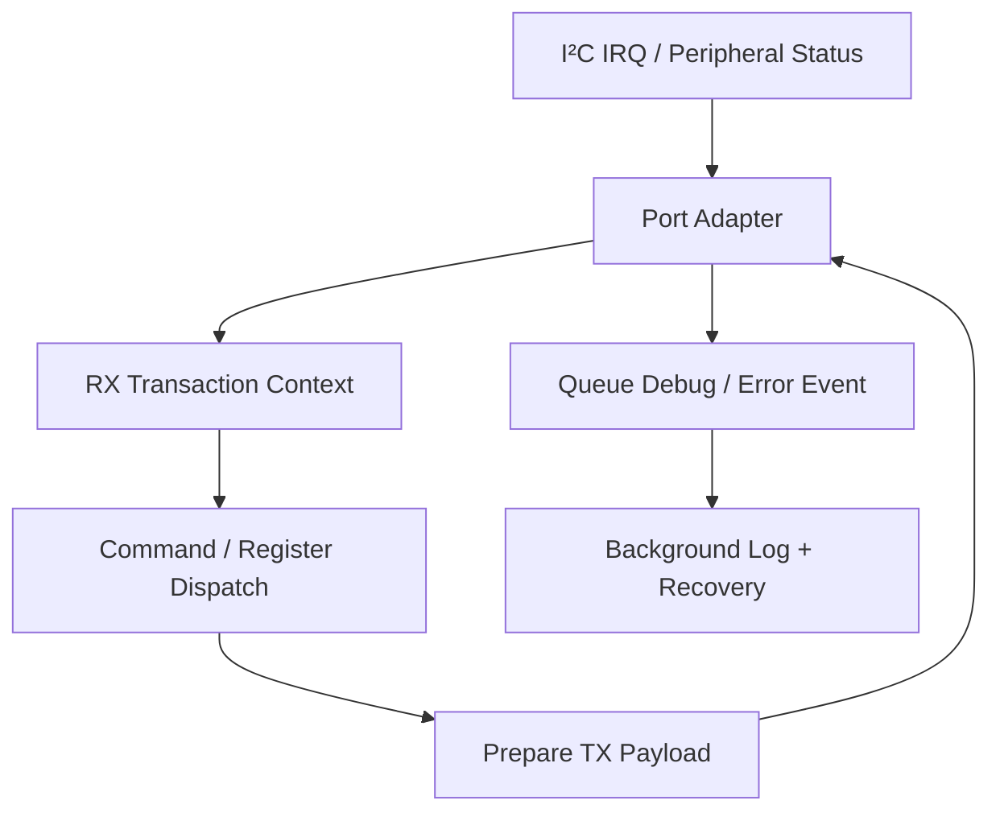

[回到知識庫總索引](../) · [SMBus](smbus/) · [PMBus](pmbus/)

<a id="article_top"></a>

# I²C → SMBus → PMBus 知識庫

> 整理 I²C electrical／frame／controller-target、SMBus transaction 與 PMBus command language 的分層關係。最後更新：2026-07-12。

## 協定層次

| 層次 | 內容 | 連結 |
|---|---|---|
| I²C | SDA/SCL、START/STOP、address、ACK、repeated START 如何工作？ | 本頁 |
| SMBus | 如何增加標準 transaction、PEC、timeout、ALERT 與 recovery？ | [SMBus 詳細指南](smbus/) |
| PMBus | 如何在 SMBus 上建立 power command、telemetry、status 與 profiles？ | [PMBus 詳細指南](pmbus/) |



## 1. 協定分層全貌

下圖來自 `M031BSP_I2C_Slave_PMBus`，清楚呈現 I²C physical layer、SMBus/I²C transport、PMBus standard/extension commands 與產品 application 之間的責任邊界。



重點不是「三個名稱可以互換」，而是逐層增加契約：

- I²C 定義兩線 bus、addressed byte transfer 與 arbitration／clock behavior。
- SMBus 以 I²C 為基礎，定義更明確的 electrical/timing 與 transaction protocols，並加入 PEC、timeout、SMBALERT# 等機制。
- PMBus 再使用 SMBus transport 定義 power-system command language、data formats、status 與 application profiles。

## 2. I²C electrical 基礎

`SDA` 與 `SCL` 為 bidirectional open-drain／open-collector lines，必須有合適 pull-up。裝置輸出 `0` 時拉低；輸出 `1` 時釋放，由 pull-up 拉高，因此能形成 wired-AND、arbitration 與 clock synchronization。

| 項目 | 實作重點 |
|---|---|
| Pull-up | 依 bus voltage、sink current、capacitance 與 rise-time 選擇；不能只沿用任意常見阻值 |
| Bus idle | `SDA=1` 且 `SCL=1` |
| START | `SCL=1` 時 `SDA: 1→0` |
| STOP | `SCL=1` 時 `SDA: 0→1` |
| Data valid | 一般 data bit 在 `SCL=1` 期間保持穩定 |
| Clock stretching | Target 可依規範／controller 支援能力延長 SCL low |

常見 mode：Standard-mode 100 kbit/s、Fast-mode 400 kbit/s、Fast-mode Plus 1 Mbit/s、High-speed mode 3.4 Mbit/s。不要只設定 register divider；必須連同 rise/fall time、filter、pull-up 與 target capability 驗證。

## 3. Address 與 byte transfer

每個 byte 為 8 data bits 加第 9 個 ACK/NACK clock。最常見為 7-bit address；wire 上第一個 byte 是：

```text
address_byte = (address_7bit << 1) | direction
direction: 0 = write, 1 = read
```

例如 7-bit address `0x5A`：write byte 為 `0xB4`，read byte 為 `0xB5`。Driver API 若要求 7-bit address，就不能再傳已 shift 的 `0xB4`；這是最常見的 address 錯誤之一。



## 4. Repeated START、arbitration 與 state machine

- Repeated START 在不釋放 bus 的情況下切換 direction，常用於 register read 與 SMBus combined-format transaction。
- 多 controller 同時傳送時，輸出 recessive/high 卻讀到 low 的 controller 失去 arbitration；不要把 arbitration lost 當作一般 NACK。
- Target firmware 應以 peripheral status／event 驅動 state machine，明確處理 address match、RX、TX、STOP、repeated START、NACK 與 bus error。
- ISR 應快速準備下一 byte；大量 log 與 product work 放到 background queue。

## 5. ACK/NACK 的語意

NACK 不是單一錯誤原因：

- Address NACK：無 target、address 錯、target 未 ready、voltage／wiring 問題。
- Data NACK：target 拒絕內容、buffer 滿、command／state 不合法。
- Read final-byte NACK：controller 用來表示「不再讀」，通常是正常 transaction ending。

除錯時要同時記錄「發生在哪一個 byte」與 peripheral status，而不是只顯示 `I2C fail`。

## 6. Firmware 架構



- 每個 I²C instance 應有獨立 transaction context。
- Buffer 採固定上限並驗證 length，避免 malformed block 造成 overflow。
- timeout／bus clear 與 normal TX cleanup 必須分開判斷。
- 在 analyzer 上確認 first TX data byte，不要把 read address byte 誤放進 response buffer。

## 7. I²C 與 SMBus／PMBus 的關聯

- [SMBus 詳細指南](smbus/)：transaction protocols、PEC、timeout/recovery、SMBALERT#/ARA。
- [PMBus 詳細指南](pmbus/)：power command、telemetry、status、profiles 與 validation。

### 對應工具

- [simple_pmbus_smbus_tool](https://github.com/released/simple_pmbus_smbus_tool)：包含 generic I²C master/slave tab、SMBus 與 PMBus validation。
- [simple_pmbus_gui_tool](https://github.com/released/simple_pmbus_gui_tool)：較聚焦的 PMBus GUI 與 HID bridge reference。

## 8. I²C 除錯順序

1. 量測 SDA/SCL idle voltage、pull-up、GND 與 voltage domain。
2. 確認使用 7-bit 或 8-bit address 表示法。
3. 找出 NACK 發生在 address、command 還是 data。
4. 核對 repeated START／STOP 是否符合 target 預期。
5. 觀察 SCL stretching、rise time 與 bus stuck-low。
6. 比對 MCU status、raw analyzer trace 與 application log。

## 9. 主要規範

- [NXP UM10204：I²C-bus specification and user manual](https://www.nxp.com/docs/en/user-guide/UM10204.pdf)
- [SMBus current specifications](https://www.smbus.org/specs/)
- [PMBus current specifications](https://pmbus.org/current-specifications/)

[回到頁首](#article_top)
