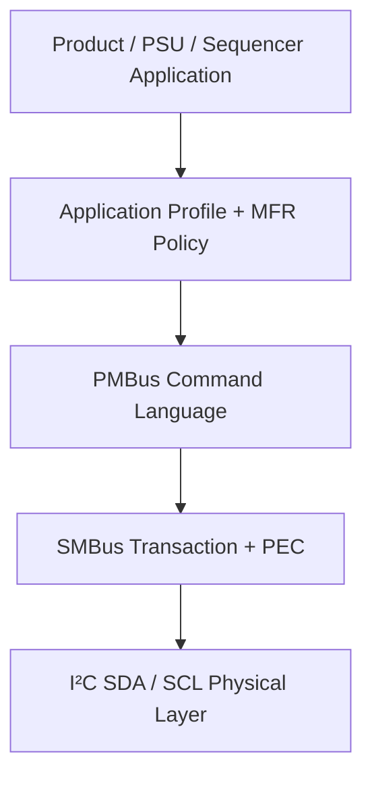
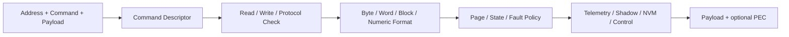
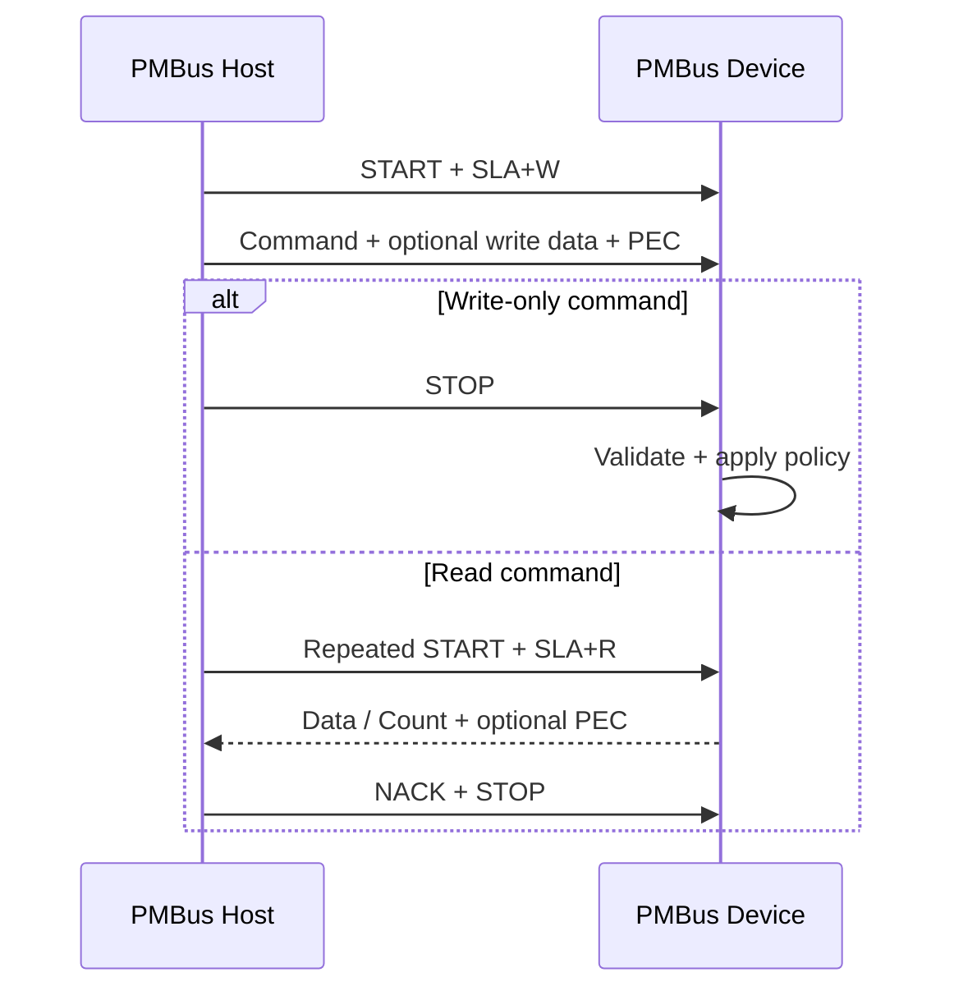
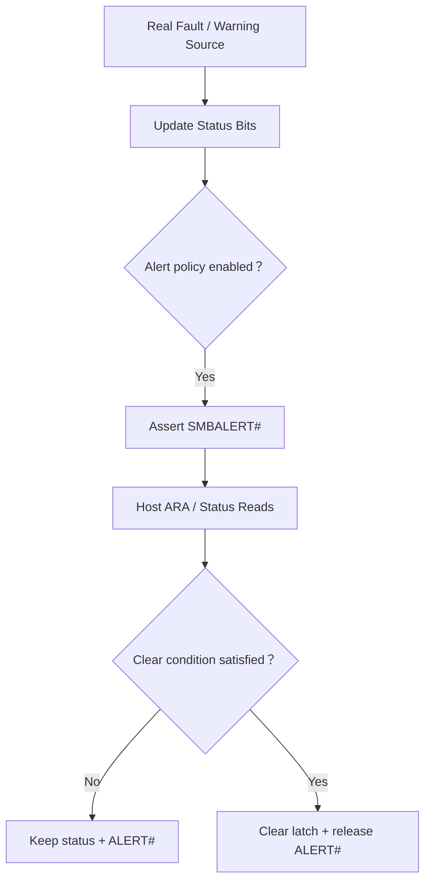

[I²C 主頁](../) · [SMBus](../smbus/) · [總索引](../../)

# PMBus 詳細指南

> PMBus 在 SMBus transport 上定義 power-system command language、data formats、status／fault handling 與 application profiles。官方 current page 目前列出 PMBus 1.5；本文的 M031 sample 明確以公開 archive 的 PMBus 1.3.1 為對齊基準。

## 1. 分層觀念

- I²C：把 addressed bytes 搬過 wire。
- SMBus：定義 transaction protocol、PEC、timeout、alert 等 transport behavior。
- PMBus：定義 command code、access type、data format、status 與 power-management semantics。
- Product profile：決定 CRPS、sequencer、POL 等具體產品行為與 MFR commands。

## 2. Command language

常見 command 群組：

| 類別 | 代表 commands | 用途 |
|---|---|---|
| Operation／configuration | `OPERATION`, `ON_OFF_CONFIG`, `PAGE` | 啟停、behavior、multi-page selection |
| Output control | `VOUT_COMMAND`, margin／transition controls | 設定輸出與轉換行為 |
| Telemetry | `READ_VIN`, `READ_VOUT`, `READ_IOUT`, `READ_TEMPERATURE_x` | 讀取量測值 |
| Status | `STATUS_BYTE`, `STATUS_WORD`, status subgroups | Fault／warning summary 與分類 |
| Limits | OV／UV／OC／OT fault/warn limits | Protection thresholds |
| Fault handling | `CLEAR_FAULTS`, response configuration | 清除 latched state 與設定 response |
| Inventory | `MFR_ID`, `MFR_MODEL`, `MFR_REVISION` | 裝置識別 |
| Extended／MFR | `MFR_SPECIFIC_*`, USER data, extended commands | Profile／vendor／OEM 擴充 |

不是所有裝置都必須實作全部 commands；合法 command、transaction type、read/write access、data format 與 page behavior 必須以 active PMBus revision、application profile 與產品規格為準。

## 3. 一個 command 不只是一個 register

PMBus command handler 通常需要：

Descriptor 至少應記錄 command ownership、legal protocols、payload bounds、read/write permission 與 handler。不要用一個巨大 `switch` 同時混合 transport、decode、product side effect 與 debug print。

## 4. Data formats

PMBus 常見資料型態包括 raw byte／word、bit fields、ASCII/block，以及 LINEAR、DIRECT 等數值格式。解碼時要同時知道 command 的 format metadata；同一組 16-bit raw bytes 不能脫離 command context 直接當作固定電壓值。

實作檢查：

- SMBus word byte order 與 signed field。
- LINEAR exponent／mantissa 的 sign extension。
- `PAGE` 對 telemetry、limits 與 status shadow 的影響。
- Unit 與 scaling 是否由 profile／device 定義。
- Out-of-range、unsupported command 與 invalid data 的 status policy。

## 5. Standard、profile 與 extension command

指定的架構圖說明了最重要的 interoperability 邊界：standard commands 可以跨裝置共用；MFR／USER／profile commands 不能只因 command code 相同就假設語意相同。

例如同一個 MFR code point 在 Base、M-CRPS 與 TI UCD90xxx profile 可能具有不同 command name、transaction 與 payload。Firmware／GUI 以 active profile 作為 command 解析 context。

## 6. Transaction flow

Bus-critical path 應在 ISR 內完成 address/status handling 與下一 TX byte prepare；command side effects、telemetry refresh、debug print 與 recovery 則位於受控的 background context。

## 7. Status、fault 與 SMBALERT#

Status policy chain：

- ARA identifies an alerting device，不等於自動清除所有 faults。
- `CLEAR_FAULTS`、status reads 與 physical fault disappearance 的關係由規範與 product policy 決定。
- Transport 只負責可靠傳遞；不要在 generic SMBus layer 硬編產品 fault behavior。

## 8. M031 PMBus slave reference

[M031BSP_I2C_Slave_PMBus](https://github.com/released/M031BSP_I2C_Slave_PMBus) 提供：

- Address／repeated START／PEC／SMBALERT#/ARA／ARP／Zone aliases。
- PMBus Base、M-CRPS、TI UCD90xxx command-name profiles。
- Byte、Word、Read32、Block、Process Call、Group Command 等 paths。
- Support matrix、validation checklist、TI ScriptForm sequence、UART 與 LA captures。
- Software SCL-low timeout 與 bus recovery。

### Sample 的重要產品邊界

部分 telemetry／inventory／MFR commands 使用 fixed placeholder 或 volatile shadow，目的是驗證 host-visible protocol。正式產品必須接到：

- 真實 ADC／power-control telemetry。
- Fault／warning sources 與保護 policy。
- Nonvolatile STORE／RESTORE behavior。
- Approved MFR／USER command ownership。
- Firmware update、black-box、inventory 與 security policy。

固定值能通過 GUI，不代表 power product 已完成。

## 9. Host tools

| Tool | 用途 |
|---|---|
| [simple_pmbus_smbus_tool](https://github.com/released/simple_pmbus_smbus_tool) | PMBus Base／M-CRPS／TI UCD90xxx、SMBus、generic I²C、CSV scripts、PEC negative tests |
| [simple_pmbus_gui_tool](https://github.com/released/simple_pmbus_gui_tool) | PMBus-focused GUI 與 HID bridge reference |

`simple_pmbus_smbus_tool` 的 GUI 透過 Nuvoton USB HID bridge 讓 M032 EVB 成為 PMBus／SMBus host。工具一次維持一個 active I²C owner，並提供 Scan、Basic、PEC、Error、Telemetry、MFR、Full 等獨立驗證功能；結果可與 target UART 及 logic analyzer 對照。

## 10. Validation checklist

1. Physical：voltage、pull-up、idle、address ACK。
2. Identity：`PMBUS_REVISION`、`MFR_ID`、`MFR_MODEL`。
3. Basic read/write：byte、word、block、repeated START。
4. PEC：good／missing／bad PEC。
5. Status：normal、warning、fault、clear policy。
6. Telemetry：format、unit、range、page。
7. Unsupported／invalid：command、data、length、state。
8. Profile：Base 與 MFR namespaces 不交叉誤解。
9. Recovery：stuck SCL、bus clear、重新開啟 device context。
10. Stress：repeat、delay variation、logging load 與 long block bounds。

## 11. 常見問題

| 現象 | 檢查項目 |
|---|---|
| Command ACK 但數值不合理 | Data format、sign、exponent、unit、PAGE |
| 同 command code 在兩台 device 解法不同 | Active profile 與 MFR command ownership |
| GUI 顯示成功但產品沒動作 | Handler 是否仍為 placeholder/shadow |
| PEC read only failure | Read address byte、count、response bytes 的 CRC coverage |
| ALERT# 無法 release | Fault source、latch、clear condition、ARA policy |

## 12. 規範與來源

- [PMBus current specifications](https://pmbus.org/current-specifications/)
- [PMBus specification archives（含公開 PMBus 1.3.1）](https://pmbus.org/specification-archives/)
- [PMBus FAQ：protocol parts 與 AVSBus 說明](https://pmbus.org/Resources/FAQ/)
- [SMBus 3.3.1](https://www.smbus.org/specs/SMBus_3_3_1_20241020.pdf)

[回到頁首](#article_top)
