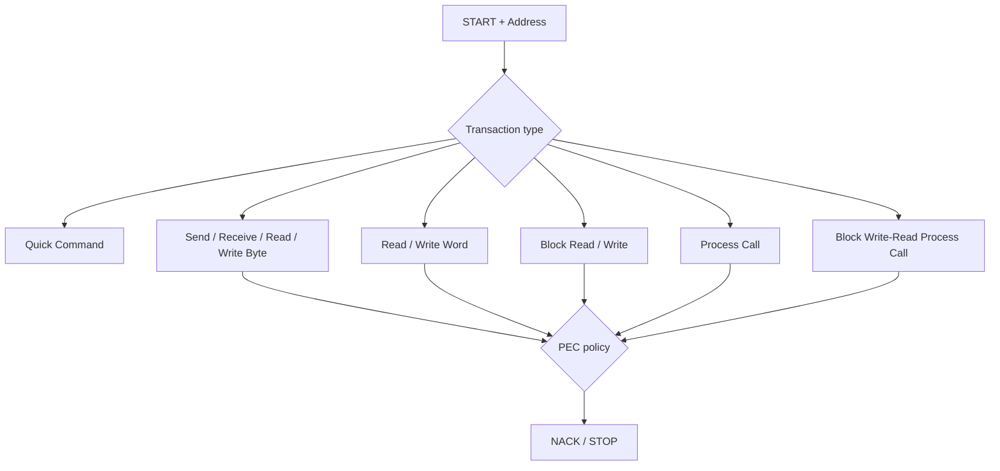
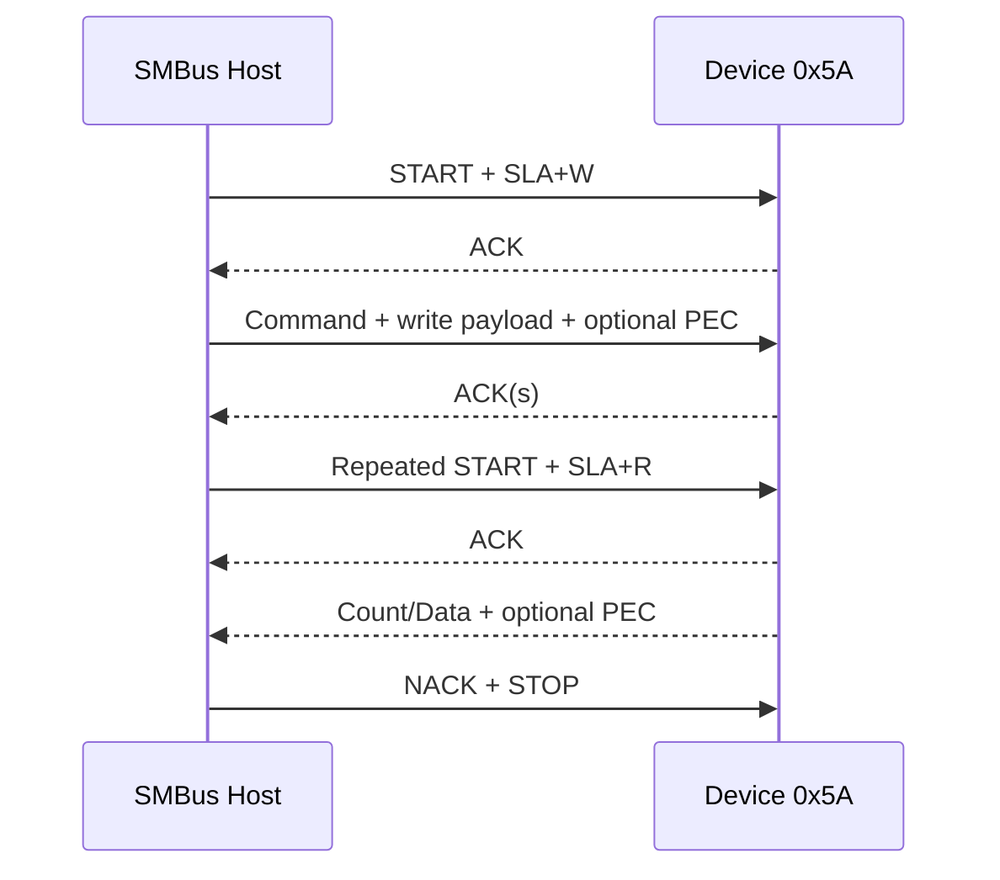
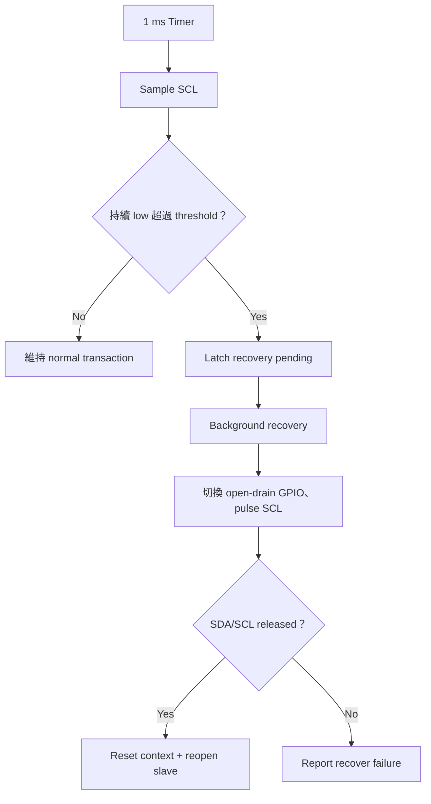

[I²C 主頁](../) · [PMBus](../pmbus/) · [總索引](../../)

<a id="article_top"></a>

# SMBus 詳細指南

> SMBus 建立在 I²C bus concept 之上，進一步定義 electrical/timing、標準 transaction protocols、PEC、timeout/recovery 與 system-management services。本文以官方 SMBus 3.3.1 與 M031 slave validation sample 為主。

## 1. I²C 與 SMBus 的邊界

| 面向 | I²C | SMBus |
|---|---|---|
| 核心線路 | SDA/SCL、open-drain | SMBDAT/SMBCLK，仍為 two-wire open-drain bus |
| 資料交換 | Addressed byte transfer | 定義 Quick、Byte、Word、Block、Process Call 等 protocols |
| 完整性 | ACK/NACK；application 可自行加 checksum | 可使用 PEC（CRC-8） |
| Timing | 多種 I²C modes 與 clock stretching | 加入 SMBus electrical/timing 與 timeout expectations |
| System service | 由 application 定義 | SMBALERT#、ARA、ARP 等服務 |
| Command meaning | 由 device protocol 定義 | SMBus transaction layer 本身仍不替所有 command byte 定義產品語意 |

> 「MCU I²C peripheral 能傳 byte」不代表 SMBus 已完成。還需要 transaction framing、PEC、timeout/recovery、alert policy 與 upper-layer command ownership。

## 2. Standard transaction protocols



常見 protocols：

- Quick Command：address phase 表達 command，沒有 data byte。
- Send Byte／Receive Byte：沒有獨立 command byte的單 byte flow。
- Write/Read Byte、Write/Read Word：command code 後接固定寬度 data。
- Block Write／Block Read：以 count 表示 variable-length payload。
- Process Call：write word 後 repeated START read word。
- Block Write-Read Process Call：write block 後 repeated START read block。

Transaction type 決定 wire format；command byte 的產品意義則由 upper profile／產品規格決定。M031 sample 的 `0x10..0x61` 是 transaction validation hooks，不是 SMBus 通用產品 commands。

## 3. Combined format 與 repeated START



Firmware 不應在 repeated START 時丟失 pending command context。M031 sample 的做法是：

1. Write phase 保存 command、payload 與 PEC context。
2. `STOP_RESTART` 區分真正 STOP 與 combined-format transition。
3. `SLA_R_ACK` 恢復 pending request，dispatch command 並先把第一個 TX byte 寫入 data register。
4. 後續 ACK/NACK 推進或結束 TX。

## 4. PEC：Packet Error Code

PEC 使用 CRC-8 polynomial `0x07`，用於偵測 address／command／data path 的傳輸錯誤。實際計算涵蓋哪些 address bytes 與 data bytes 取決於 transaction protocol；不要只對 payload 做 CRC。

```text
CRC-8 polynomial: x^8 + x^2 + x + 1  (0x07)
Initial value: follow the active SMBus specification / transaction definition
```

PEC policy examples：

- Disabled：bring-up 或不要求 PEC 的 target。
- Optional：同時接受有／無 PEC，用於相容驗證。
- Required：產品要求時，缺少或錯誤 PEC 必須走明確 error path。

驗證不能只測 good PEC；應強制 bad PEC，確認 target 拒絕 frame、記錄 error，而且下一筆正常 transaction 仍可成功。

## 5. Timeout 與 bus recovery

SMBus 對 clock-low timeout 的要求比一般「可無限 stretching」的 I²C 心智模型更嚴格。M031 sample 以 1 ms timer 取樣 SCL，預設 threshold 為 35 ms；這是 sample 配置，產品仍須核對使用的 SMBus revision 與 device class。



Timer ISR 只 latch recovery，不在 ISR 內完成 bus clear；這能避免長時間阻塞其他 interrupt。

## 6. SMBALERT#、ARA 與 ARP

- `SMBALERT#`：active-low open-drain alert signal；必須有 pull-up。
- ARA（Alert Response Address）：host 透過特定 address 找出 alerting device。
- ARA 回應不等於自動清除 fault；何時 release ALERT# 是 upper-layer／產品 policy。
- ARP（Address Resolution Protocol）：用於 address assignment／discovery 的服務；是否實作依系統需求。

分層邊界：SMBus transport 提供 assert/release 與 ARA response mechanism；upper profile 擁有 fault latch、status command、clear condition 與 release policy。

## 7. M031 reference implementation

[M031BSP_I2C_Slave_SMBus](https://github.com/released/M031BSP_I2C_Slave_SMBus) 提供：

- Normal I²C slave controller + software SMBus transaction handling。
- Quick、Byte、Word、Block、Process Call、Block Write-Read Process Call。
- PEC disabled／optional／required policy。
- Software SCL-low timeout、bus-clear recovery。
- Generic transaction profile 與 SFF-TA-1005 UBM validation shell。
- Support matrix、validation checklist、UART logs 與 logic-analyzer captures。

重要界線：Generic command map 只驗證 transaction layer；要做實際產品，必須由產品 owner 定義 command ownership、telemetry、nonvolatile behavior、side-band signals 與 fault policy。

## 8. Tools

| Tool | 用途 |
|---|---|
| [simple_pmbus_smbus_tool](https://github.com/released/simple_pmbus_smbus_tool) | SMBus Generic／UBM `Run All`、PEC negative test、bus recovery、I²C bridge |
| [simple_smbus_sgpio_tool](https://github.com/released/simple_smbus_sgpio_tool) | SMBus register validation與 SGPIO slot pattern 的整合 sequence |

### Validation items

1. Address scan／bus idle preflight。
2. Quick、Send/Receive Byte。
3. Byte／Word read-write。
4. Block read-write。
5. Process Call 與 Block Write-Read Process Call。
6. PEC on/off 與 bad PEC。
7. Repeated START 壓力測試。
8. SCL-low timeout 與 bus recovery。
9. 對照 GUI log、MCU UART 與 analyzer raw bytes。

## 9. 常見問題

| 現象 | 檢查項目 |
|---|---|
| Address ACK，但 read data 第一 byte 錯 | repeated START context、第一個 TX byte prepare timing |
| PEC 全部失敗 | address byte、R/W bit、count byte、byte order 是否納入 CRC |
| 偶發 stuck bus | pull-up、clock stretching、timeout path、recovery ownership |
| ARA 後 ALERT# 一直 low | upper profile fault 是否仍 active；ARA 不一定清 fault |
| Sample command 可用但產品 command 不工作 | command map／profile ownership 尚未實作 |

## 10. 規範與延伸

- [SMBus Specification 3.3.1](https://www.smbus.org/specs/SMBus_3_3_1_20241020.pdf)
- [SMBus specifications index](https://www.smbus.org/specs/)
- [PMBus 詳細指南](../pmbus/)

[回到頁首](#article_top)
