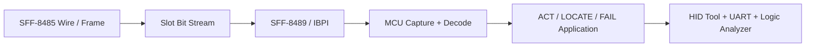
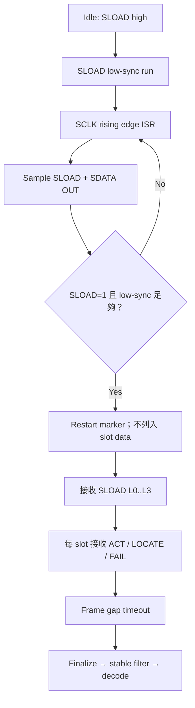
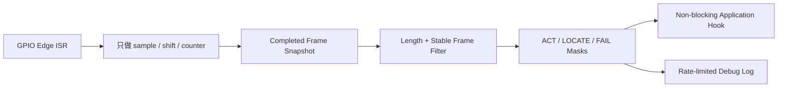

[回到知識庫總索引](../) · [I²C / SMBus / PMBus](../notices_i2c/)

<a id="article_top"></a>

# SGPIO 詳細知識庫

> 從 SFF-8485 wire/frame、SFF-8489／IBPI slot indicators，到 M031／MS51 software receiver 與 PC HID 測試工具。最後更新：2026-07-12。

## 內容範圍

- 分清楚 `SCLK`、`SLOAD`、`SDATA OUT`、`SDATA IN` 的方向與取樣時機。
- 看懂 frame marker、`SLOAD L0..L3`、slot triplet 與 LSB-first raw decode。
- 了解 software SGPIO 為何必須把 edge capture、frame finalize、decode 與 log 分層。
- 能用 UART、logic analyzer 與 HID tool 建立可重複驗證流程。



## 1. SGPIO 解決什麼問題

SGPIO（Serial GPIO）用少量訊號週期性傳送多個 drive／slot 的狀態，常見於 storage backplane 與 enclosure indicator。它不是 I²C：沒有 address + ACK 的 transaction 模型，而是由 initiator 持續產生同步 clock 與 slot stream。

| Signal | 典型方向（以 initiator 為基準） | 用途 |
|---|---|---|
| `SCLK` | Initiator → Target | 所有 SGPIO bit 的同步時脈 |
| `SLOAD` | Initiator → Target | low-sync、restart marker 與 frame-level `L0..L3` |
| `SDATA OUT` | Initiator → Target | 送往 backplane／target 的 per-slot indicator bits |
| `SDATA IN` | Target → Initiator | 回傳 presence／state；是否使用由產品實作決定 |

> 本知識庫引用的 M031／MS51 software SGPIO sample 目前聚焦 `SCLK + SLOAD + SDATA OUT` 接收；`SDATA IN` transmit 尚未實作。這是 sample scope，不是 SGPIO 規範本身的限制。

## 2. Frame 與 slot 資料

### 2.1 接收流程

目前 M031 sample 使用 `SCLK` rising edge 作為唯一 capture interrupt；ISR 一進入就取樣 `SLOAD` 與 `SDATA OUT`。`SLOAD` 的變化本身不觸發 frame event，避免把 `L0..L3` 變化誤判成新 frame。



M031 sample 使用至少 5 個 low-sync clocks、4 個 `L0..L3` bits、每 slot 3 bits，並以 frame-gap timeout 結束 capture。這些常數應視為該 sample 的 contract；移植時仍須核對 initiator 與 SFF-8485 timing。

### 2.2 `L0..L3` 與 slot bits 不同

- `SLOAD L0..L3`：frame-level vendor-specific field；sample 只保留 raw value，不擅自賦予產品語意。
- `SDATA OUT` slot bits：依序解碼為 `ACT`、`LOCATE`、`FAIL`。
- 產品層 LED／rebuild 行為通常依 SFF-8489／IBPI 與產品需求解讀。

| Slot bit | Sample semantic | 常見用途 |
|---:|---|---|
| 0 | `ACT` | Activity indicator |
| 1 | `LOCATE` | Identify / locate indicator |
| 2 | `FAIL` | Fault indicator；與其他 bit 的組合語意由產品定義 |

### 2.3 LSB-first raw decode

Sample 將 capture byte 依 LSB-first 消耗：

```text
bit_index = byte_index * 8 + bit_in_byte
bit_value = (raw[byte_index] >> bit_in_byte) & 0x01

Slot N ACT    = bit (N * 3 + 0)
Slot N LOCATE = bit (N * 3 + 1)
Slot N FAIL   = bit (N * 3 + 2)
```

例如 raw byte `0x38` 的一般顯示是 `0011 1000`，但解碼順序為 bit0→bit7：`0,0,0,1,1,1,0,0`。若 analyzer 顯示正確但 slot 全部位移，優先檢查 bit order、restart marker 是否被誤收，以及 slot count。

## 3. Software SGPIO 實作分層



實作原則：

- ISR 內不可 `printf()`，也不要 busy-wait。
- edge path 只維護必要的 capture state；decode 與 log 放到 background。
- application hook 應設定輸出狀態，不要因週期性重複 frame 而不斷 toggle。
- 使用 heartbeat 確認 main loop 沒被 SGPIO 處理阻塞。
- 若使用 shared GPIO IRQ，`SCLK` flag 必須優先處理。

## 4. 參考 firmware

| Repository | MCU／用途 | 重點 |
|---|---|---|
| [M031BSP_Software_SGPIO](https://github.com/released/M031BSP_Software_SGPIO) | M031/M032 target receiver | Shared GPIO ISR、stable filter、ACT/LOCATE/FAIL decode |
| [MS51_Software_SGPIO](https://github.com/released/MS51_Software_SGPIO) | MS51 target receiver | 8051 平台上的 software SGPIO 對照實作 |
| [M031BSP_Software_SGPIO_I2C_Slave](https://github.com/released/M031BSP_Software_SGPIO_I2C_Slave) | SGPIO + SMBus/I²C slave | SGPIO profile 與多個 SMBus slave adapters 的整合案例 |

> Sample 中的 pin、timeout、address 與 command map 是驗證配置，不應直接當作所有產品的固定規格。

## 5. PC tools 與驗證

| Tool | 用途 | 使用情境 |
|---|---|---|
| [simple_sgpio_test_tool](https://github.com/released/simple_sgpio_test_tool) | SGPIO waveform、slot masks、periodic frame、HID bridge | 單獨驗證 SGPIO initiator／target |
| [simple_smbus_sgpio_tool](https://github.com/released/simple_smbus_sgpio_tool) | SMBus register sequence + SGPIO pattern | 驗證 SGPIO 狀態是否正確反映到 target register／LED policy |

### 驗證流程

1. 確認 common GND、signal direction 與 pin map。
2. 採用慢速 `SCLK` 和少量 slots 建立 known-good frame。
3. Logic analyzer 同時擷取 `SCLK`、`SLOAD`、`SDATA OUT`。
4. 比對 tool 設定、analyzer raw bits 與 target UART masks。
5. 測試 `ACT`、`LOCATE`、`FAIL` 單獨與組合 pattern。
6. 增加 slot count、clock 與 periodic rate，觀察 dropped／unstable frames。
7. 若與 SMBus 結合，再比對 slot registers 與 manual override policy。

## 6. 常見問題

| 現象 | 檢查項目 |
|---|---|
| 完全收不到 frame | Pin map、GND、SCLK interrupt、signal direction |
| `unstable frame ignored` | 降低 SCLK、縮短 wiring、確認 setup/hold |
| Slot 全部位移 | low-sync、restart marker、LSB-first、slot count |
| Heartbeat 停止 | ISR／background 是否有 `printf()`、busy loop 或過量 log |
| Tool 正常但 application LED 不動 | application hook、mask-to-output mapping、override mode |

## 7. 主要規範與來源

- [SNIA SFF-8485：Serial GPIO Bus](https://www.snia.org/node/15441)
- [SNIA SFF specifications（含 SFF-8485、SFF-8489）](https://www.snia.org/sff/specifications2)
- [M031 SGPIO protocol contract](https://github.com/released/M031BSP_Software_SGPIO/blob/main/docs/SGPIO_PROTOCOL_CONTRACT.md)

[回到頁首](#article_top)
